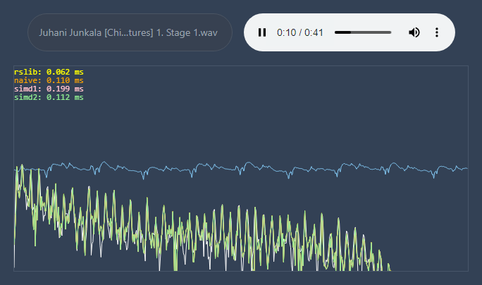
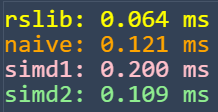

# wasm-simd-audio

An exporation in FFT implementation using Rust+WASM+SIMD.

🎧 [Live demo](https://krscott.github.io/wasm-simd-audio/)

> ⚠ SIMD does not yet have support in every modern browser. Be sure to use a [browser that supports WASM SIMD](https://webassembly.org/roadmap/).

## Usage

1. Get a [punchy audio file](https://opengameart.org/art-search-advanced?keys=&field_art_type_tid%5B%5D=12&sort_by=count&sort_order=DESC) ready to upload
2. Open the [webpage](https://krscott.github.io/wasm-simd-audio/)
3. Click the bubble on the left to select an audio file to play
4. Click Play ▶ on the audio widget

The calculation time of each algorithm is shown in the upper left with matching color to its plot. The white plot is the FFT plot given by the browser's audio AnalyzerNode as reference.



## About
In this project, I implement a basic FFT algorithm using WASM SIMD instructions  ([`std::arch::wasm32`](https://doc.rust-lang.org/core/arch/wasm32/index.html)).

For example, here is the function for multiplying 2 pairs of complex numbers in parallel using `f32x4` vectors:

https://github.com/krscott/wasm-simd-audio/blob/76f824dbddc08d2cc2702f6729183240de7077d5/wasm-audio/src/simd_cooley_tukey2.rs#L47-L90

## Results
Although SIMD instructions do allow much faster computation throughput, they do require extra instructions for loading values in and out of the vectors. In my case, one of my SIMD implementations barely matches my naive implementation, and is still 2x slower than the `rustfft` crate:



It seems that, at least with the basic Cooley-Tukey algorithm, using SIMD for just inside the body of the loop introduces too much overhead to see much improvement, especially compared to normal optimization. I tried keeping the intermediate values as `v128` vectors to save some conversion (see [`simd_cooley_tukey3.rs`](wasm-audio/src/simd_cooley_tukey3.rs)), but it didn't seem to have much effect.

## TODO

- [ ] Compare generated WASM instructions to see how wasm-pack is optimizing. The `wasm32` instructions might be preventing some compiler optimizations.
- [ ] Look into [SFFT](https://www.cs.waikato.ac.nz/~ihw/PhD_theses/Anthony_Blake.pdf) implementation.
- [ ] Move WASM code to worker node. Currently the FFTs are evaluated in the main thread. This requires manually sending the WASM binary blob to the worker thread at runtime.

## Development
To start:
```
npm run dev
```

### Setup Tips
**vscode**: in the workspace `settings.json`, set the target to wasm32:
```
  "rust-analyzer.cargo.target": "wasm32-unknown-unknown"
```

**wasm-opt issue**: If you get an error about wasm not being optimized, then install
latest version of [binaryen](https://github.com/WebAssembly/binaryen) and put it
in your `PATH`. It will work without, but the benchmark will be wrong.
([more info](https://github.com/rustwasm/wasm-pack/issues/1109))

## Deployment

> ⚠ Be sure you don't have any `wasm-opt` errors (see above)!

Github pages:
```
npm run deploy
```

